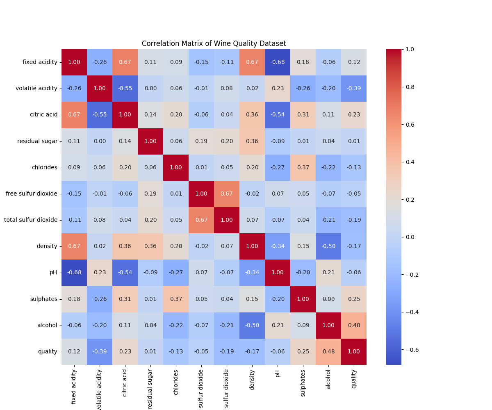
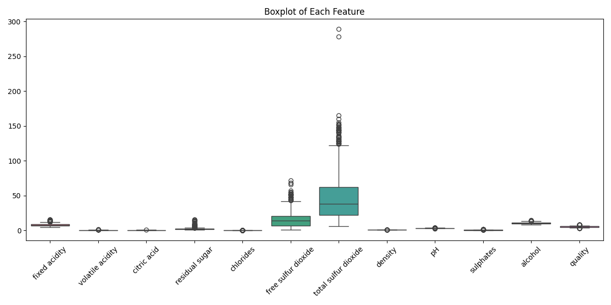
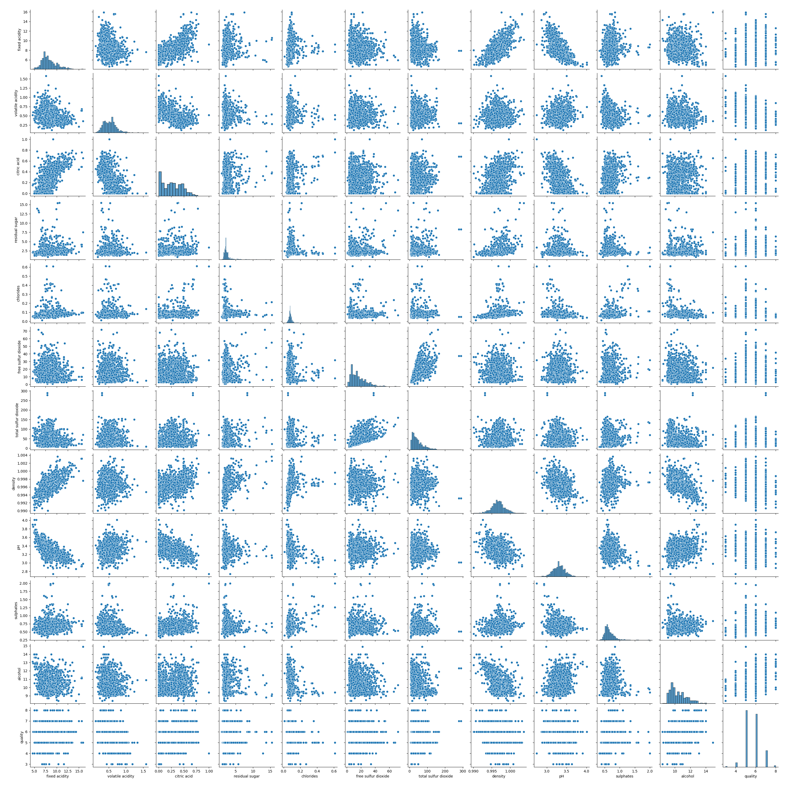
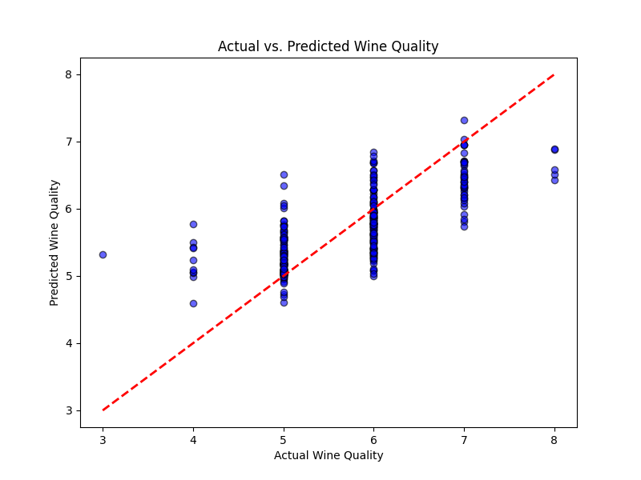

# Wine Quality Prediction using Random Forest Regressor

This project demonstrates a machine learning workflow to predict the quality of red wines based on their physicochemical properties. It utilizes the Wine Quality (red wine) dataset from the UCI Machine Learning Repository and employs a Random Forest Regressor for modeling, including hyperparameter tuning using `GridSearchCV`.

## Project Structure

-   `wine_quality_prediction.py`: The main Python script containing the data acquisition, preprocessing, EDA, model development, hyperparameter tuning, and plotting functions.
-   `results/`: This directory will be created automatically upon running the script and will store all the generated plots and the saved machine learning model.
-   `README.md`: This file provides an overview of the project and instructions.

## Features

-   **Data Acquisition:** Loads the red wine quality dataset directly from the UCI repository.
-   **Data Cleaning & Preprocessing:** Checks for missing values and duplicate rows.
-   **Exploratory Data Analysis (EDA):**
    -   Visualizes the correlation matrix to understand relationships between features.
    -   Generates box plots for each feature to identify potential outliers.
    -   Creates a pairplot for visualizing pairwise relationships between all variables.
-   **Feature Engineering:** Includes an example of creating an interaction feature (`acidity_ph_interaction`).
-   **Model Development:** Implements a Random Forest Regressor to predict wine quality.
-   **Hyperparameter Tuning:** Uses `GridSearchCV` to find the optimal hyperparameters for the Random Forest model, improving its performance.
-   **Model Evaluation:** Evaluates model performance using Root Mean Squared Error (RMSE) and R-squared (R2) score.
-   **Visualization of Results:**
    -   Scatter plot comparing actual vs. predicted wine quality.
-   **Model Persistence:** Saves the best-trained model using `joblib` for future use.

## How to Run the Code

1.  **Save the code:** Save the provided Python code as `wine_quality_prediction.py` in a directory of your choice.

2.  **Install Required Libraries:**
    The code relies on the following Python libraries. If you don't have them installed, you can install them using `pip`:

    ```bash
    pip install pandas numpy matplotlib seaborn scikit-learn joblib
    ```

3.  **Run the Script:**
    Open your terminal or command prompt, navigate to the directory where you saved `wine_quality_prediction.py`, and run the script using the Python interpreter:

    ```bash
    python wine_quality_prediction.py
    ```

    The script will print progress messages to the console, including dataset information, model performance metrics, and the best hyperparameters found. It will also create a `results/` directory in the same location as your script and save all the generated plots and the trained model inside it.

## Generated Plots and Saved Model

Upon successful execution, the `results/` directory will contain several `.png` image files and a `.pkl` model file. Here's a description of what you will find:

-   **`correlation_heatmap.png`**:
    This heatmap displays the Pearson correlation coefficients between all features in the dataset, helping to understand feature relationships and multicollinearity.

    

-   **`feature_boxplots.png`**:
    Box plots for each physicochemical feature, useful for visualizing their distribution and identifying potential outliers.

    

-   **`pairplot.png`**:
    A grid of scatter plots showing pairwise relationships between all features, with histograms on the diagonal. This helps in understanding data distribution and potential linear/non-linear relationships.

    

-   **`actual_vs_predicted_quality.png`**:
    A scatter plot comparing the actual wine quality values from the test set against the quality values predicted by the tuned Random Forest model. The red dashed line represents perfect predictions.

    

-   **`best_rf_model.pkl`**:
    This file contains the trained Random Forest Regressor model with the best hyperparameters found by `GridSearchCV`, saved using `joblib`. You can load this model later to make new predictions without retraining.

    ```python
    import joblib
    # Load the saved model
    loaded_model = joblib.load('results/best_rf_model.pkl')
    # Now you can use loaded_model to make predictions
    # For example: loaded_model.predict(new_data)
    ```

## Contributions

Feel free to fork the repository, experiment with different models or feature engineering techniques, and contribute improvements.